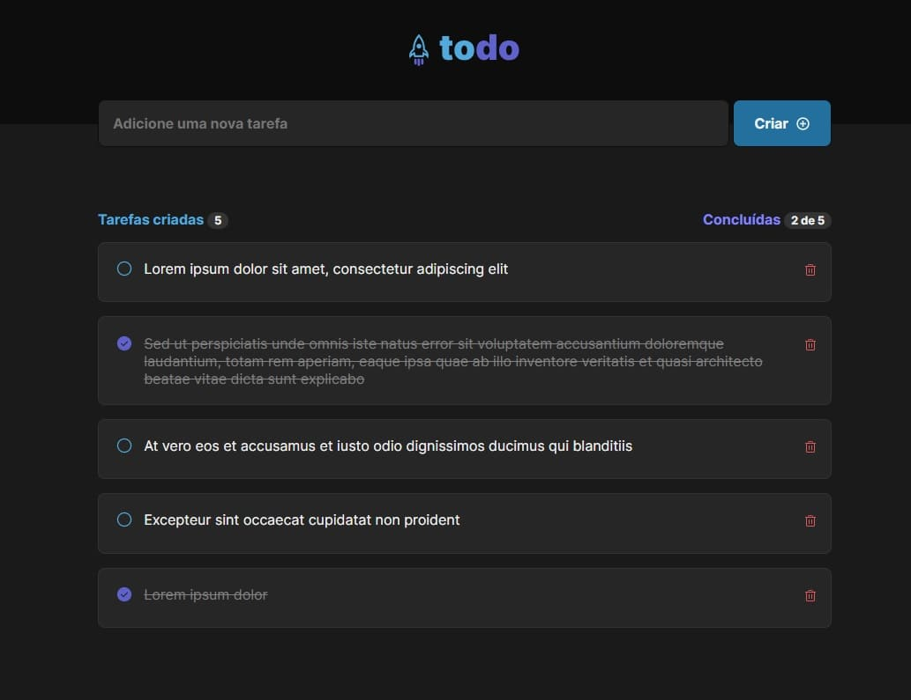

<p align="center">
  
</p>

<p align="center">
    <strong>Aplicativo web de todo list.</strong>
</p>

<p align="center">
  
  
  
  
</p>

<p align="center">
  
</p>


```bash
# Clone o repositório
git clone https://github.com/by-unfear/ignite-todo-app.git

# Acesse a pasta do projeto
cd ignite-todo-app

# Instale as dependências
npm install

# Execute a aplicação
npm run dev

```

---

Feito com 💜 por [Roberson](https://github.com/by-unfear)